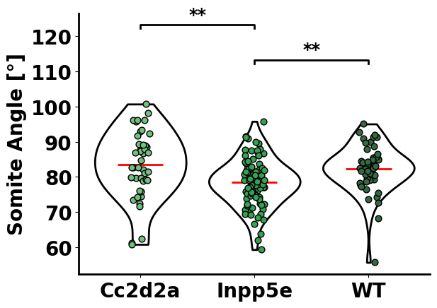

# plotdelice
A collection of functions to plot old school style graphs

```python
from plotdelice.graphs import violinplot_delice, barplot_delice, multiplot_delice
x_group = "genotype"
y_variable = "angle"
violin_width = 0.8
y_label = r'Somite Angle [°]'

violinplot_delice(df,x_group,y_variable,violin_width=violin_width,y_label=y_label,palette="Greens_d",point_size=40,jitter=0.09,title="",title_size = 50)
```


- TODO
[] Add more than the t-test
[] Improve multilevel plotting